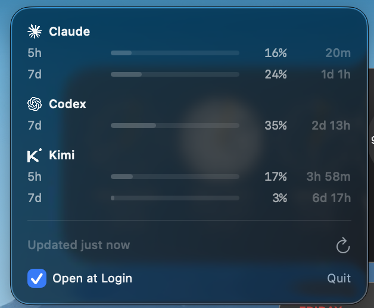

# Headroom

A macOS menu bar app that shows how much of your AI coding subscription quota you
have left, across Claude Code, OpenAI Codex, and Kimi for Coding.

The menu bar shows the single window closest to its limit — for example
`Claude 5h 14%`. Click it for a breakdown of every window, grouped by provider,
with a meter, a percentage, and the time until each window resets.



Meters stay neutral below 60%, turn amber to 85%, and red above that. Colour is
used only for urgency — providers are identified by their name and mark.

## What it reads

| Provider | Endpoint | Windows |
| --- | --- | --- |
| Claude Code | `api.anthropic.com/api/oauth/usage` | 5h session, 7d all-models, and a per-model weekly cap when one is active |
| Codex | `chatgpt.com/backend-api/wham/usage` | one or two rolling windows, depending on plan |
| Kimi for Coding | `api.kimi.com/coding/v1/usages` | 5h rolling, 7d plan window |

These are the same endpoints each vendor's own CLI uses for its status view. None of
them consume quota, so polling is free.

Window labels (`5h`, `7d`) come from the duration each API reports; they are not
hardcoded. Claude is the exception — its API sends a window `kind` rather than a
duration, so `session` and `weekly_all` map to `5h` and `7d` explicitly.

## Credentials

Nothing is stored by this app and nothing is written back.

- **Claude** — read from the login keychain via `/usr/bin/security`, the same call
  Claude Code makes. `~/.claude/.credentials.json` is used as a fallback.
- **Codex and Kimi** — read from Hermes: the Codex token from `~/.hermes/auth.json`,
  the Kimi key from `~/.hermes/.env`.

Credentials are re-read on every poll. The app never refreshes a token, because
Anthropic and OpenAI both rotate the refresh token when it is used: refreshing here
would invalidate the copy Claude Code or Hermes holds and sign you out of them.
If a token has expired, the affected provider shows as unavailable until its own
tool refreshes it. Providers fail independently.

## Build

Requires the Swift toolchain from Xcode Command Line Tools. No Xcode project, no
`xcodegen`.

```sh
./bundle.sh      # swift build, wrap in Headroom.app, ad-hoc sign
open Headroom.app
```

Use the "Open at Login" checkbox in the dropdown to register it as a login item.
This only works from the bundled `.app`, not from `.build/release/Headroom`.

To see what the providers return without launching the UI:

```sh
.build/release/Headroom --probe
```

## Polling

Every 15 minutes. Opening the menu does not fetch — it shows the last result and
its age. The refresh button forces one, then greys out for 30 seconds. Anthropic
rate limits its endpoint and the shortest window is 5 hours, so faster polling
gains nothing.

## MCP server

`mcp/server.mjs` exposes the same numbers to coding agents through a single MCP tool,
`headroom_usage`, so an agent can check what quota is left before it fans work out
across providers.

It reads only the cache the app writes to `~/.cache/headroom/usage.json` after each
poll — it never calls a provider endpoint, so an agent can call it as often as it
likes without touching a rate limit. If the app is not running, the tool says so and
reports the age of the last snapshot rather than pretending the numbers are current.

Register it with Claude Code:

```sh
claude mcp add headroom --scope user -- node "$PWD/mcp/server.mjs"
```

Set `HEADROOM_USAGE_FILE` to point at a different cache file. Node 18 or newer; no
dependencies.

## Notes

- All three endpoints are undocumented and could change without warning. Every
  field is parsed defensively.
- Provider logos in `Icons/` come from [simple-icons](https://simpleicons.org)
  (CC0). The marks themselves remain trademarks of their owners.
- `Icons/make-icon.py` regenerates the app icon.
